# The Ray Tracer Challenge

Ray tracer implementation in pure Rust (no libraries), following Jamis Buck's [The Ray Tracer Challenge](http://raytracerchallenge.com/).

## Running locally

Run example scenes locally with:

```bash
cargo run --release --bin chapter_{5-16}
```

## Example Scenes

Credit for scenes to Manoël Trapier in his [C++ implementation](https://github.com/Godzil/DoRayMe).

### Chapter 5: Ray-Sphere Intersections

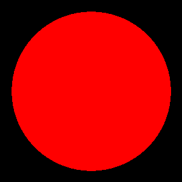

### Chapter 6: Light and Shading

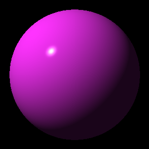

### Chapter 7: Making a Scene

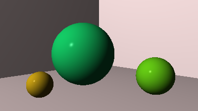

### Chapter 8: Shadows

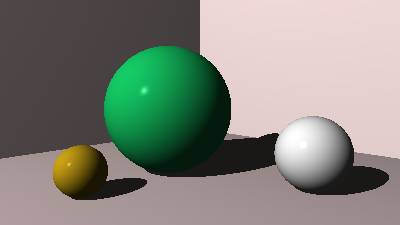

### Chapter 9: Planes

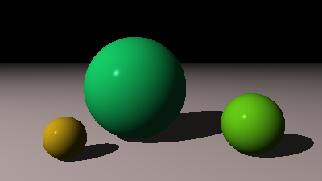

### Chapter 10: Patterns

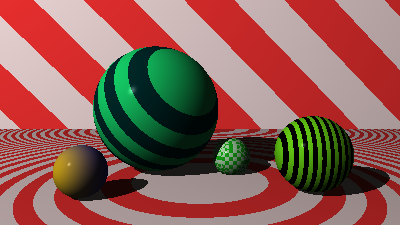

### Chapter 11: Reflection and Refraction

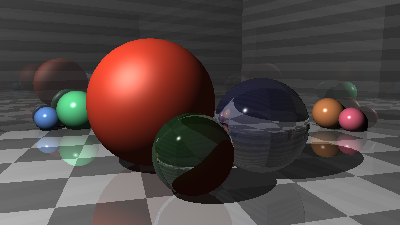

### Chapter 12: Cubes

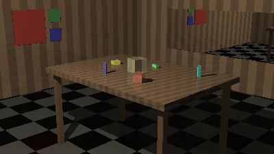

### Chapter 13: Cylinders

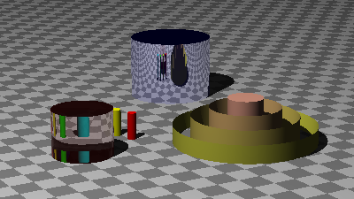

### Chapter 14: Groups

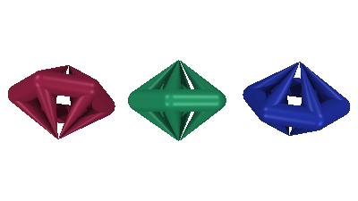

### Chapter 15: Triangles

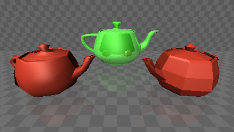

### Chapter 16: Constructive Solid Geometry

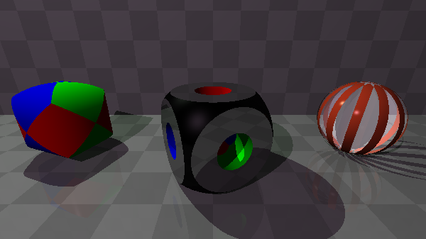
